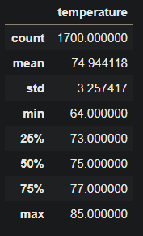
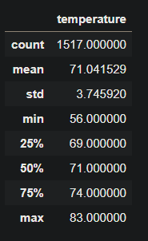

# Surf's Up with Advanced Data Storage and Retrieval

## Overview of the analysis 

The purpose of this analysis is to use SQLalchemy to generate query results from Oahu, Hawaii's weather data in the hopes of moving there and establishing a surf shop. I am working with W. Avy who is my main sponsor into acquiring business assets for the surf shop and providing him as much data as needed to pitch the idea to his associates. For this paritcular analysis I am looking at the temperatures for June and December within a 7 year time span since these months are typically when solstices begin and temperatures might be at the most extreme. 

## Results

### June

 

- Out of 1700 weather reports, June's average temperature is 74.9 degrees fahrenheit 
with temperatures ranging from 64 - 85 degrees.

### December 

 

- Out of 1517 weather reports, December's average temperature is 71 degrees fahrenheit with temperatures ranging from 56 - 83 degrees.

- Both months stay relatively warm with majority of the temperatures staying around the mid 70s.

## Summary 

In conclusion based on the above data collected, June and December have overall moderate temperatures which allow for a good time surfing. June temperatures are warm as you would expect so sales should be very consistent during this month. As for December, it will be slightly colder so the weather may not be as conducive to enjoying a day at the beach which may affect sales. Of course these temperatures are recorded multiple times a day so the peak temperatures that occur during the day may still be fine for surfing and most people wouldn't surf at night.

As for some follow up queries to help supplement this data, I would run a query on all 12 months of the year just to be comprehensive with the data. This can allow us to see how sales correspond to the weather for each month and we can categorize them into quarters. Another query would be seeing the precipitation for June and December to see how much rainfall we can expect during these two months. Rain along with cold weather can be a ditractor from surfing so as long as we have this insight, we should be prepared for what's to come. 

Oahu here I come!

